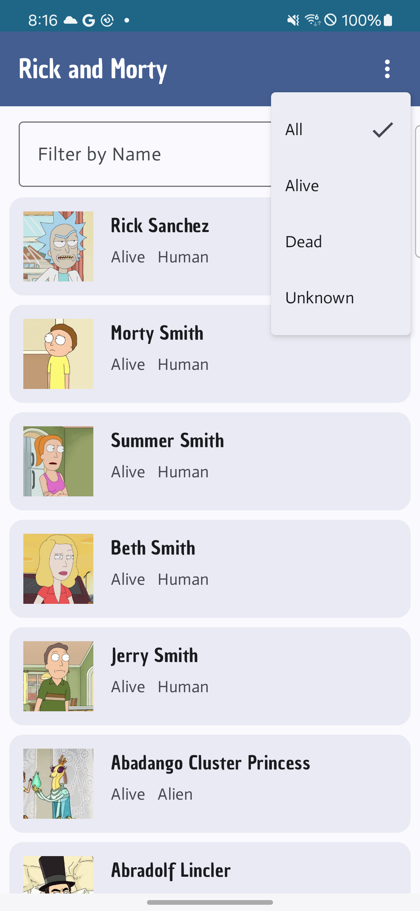
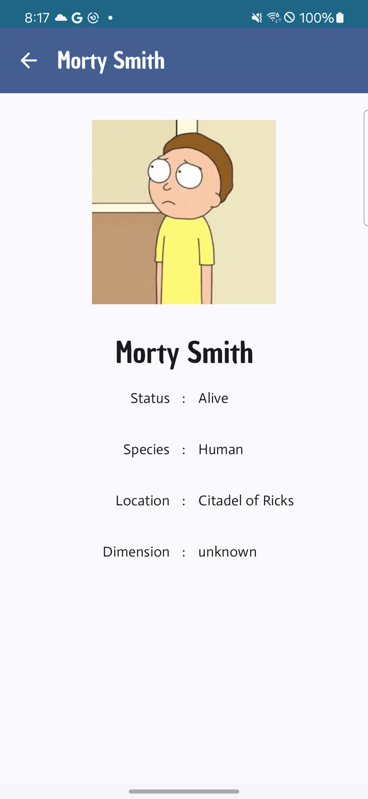

# Rick & Morty Sample Android App
This application is a sample Android app that uses [The Rick and Morty API](https://rickandmortyapi.com/) to display of list of characters. Click on a character from the list opens a more detailed view of the character.


[](https://codecov.io/gh/sberg413/Rick-and-Morty)
## Features and Best Practices

This project demonstrates several development best practices, modern Android libraries, and architectural concepts, including:

- **MVVM Architecture**: Ensures a clear separation of concerns and facilitates easier testing and maintenance.
- **Android Architecture Best Practices**: Implements clearly defined & well structured UI, Domain, and Data layers.
- **S.O.L.I.D. Principles**: Applies the S.O.L.I.D. principles for writing maintainable and scalable code.
- **Jetpack Compose**: Leverages the latest Android UI toolkit for building native user interfaces with less code.
- **Architecture Components**: Utilizes ViewModel and other Jetpack libraries for robust app structure.
- **Androidx Paging 3**: Efficiently loads and displays paginated data from the API.
- **Room Database**: Provides a seamless way to store and manage local data with SQLite.
- **Hilt Dependency Injection**: Simplifies dependency injection in the app.
- **Kotlin Coroutines and Flow**: Manages asynchronous operations and data streams effectively.
- **Retrofit**: Facilitates network requests to the Rick and Morty API.
- **Glide**: Handles image loading and caching efficiently.
- **Material 3 Theming**: Implements modern Material Design components and theming for a polished user experience.
- **Unit & Instrumentation Tests**: Ensures code quality and reliability through comprehensive unit and instrumentation testing.
- **Jacoco Code Coverage**: Measures and reports test coverage to help identify untested parts of the codebase.
- **CI/CD Workflows**: Utilizes GitHub Actions to run tests, lint checks, and code coverage on all PRs.

## Screenshots

     

    


## Getting Started

To run this project locally, follow these steps:

1. **Clone the repository**:
   ```bash
   git clone https://github.com/sberg413/RickMorty.git
   cd RickMorty
   ```

2. **Open the project in Android Studio**:

- Ensure you have the latest version of Android Studio installed.

3. **Build and run the app**:

- Connect an Android device or start an emulator.
- Click "Run" in Android Studio or use the ./gradlew assembleDebug command.


